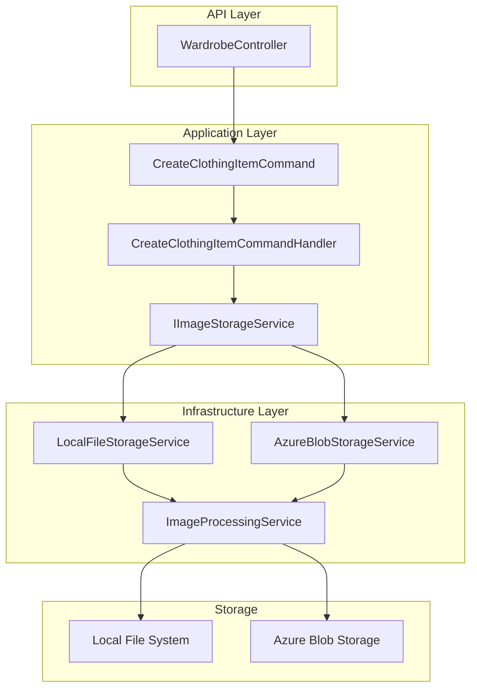

# Image Processing Service Implementation Plan

## Overview

Based on the project documentation, the Image Processing Service handles:

- Image upload and storage for clothing items
- Image resizing and optimization
- Multiple image sizes for different use cases (thumbnails, previews, full-size)
- Support for local file system and Azure Blob Storage

## Architecture



## Files to Create

### 1. Interface - Application Layer

**File:** `src/OutfitPlanner.Application/Contracts/Infrastructure/IImageStorageService.cs`

```csharp
namespace OutfitPlanner.Application.Contracts.Infrastructure;

public interface IImageStorageService
{
    /// <summary>
    /// Uploads an image and returns the storage path
    /// </summary>
    Task<ImageUploadResult> UploadImageAsync(Stream imageStream, string fileName, string? folder = null, CancellationToken cancellationToken = default);

    /// <summary>
    /// Deletes an image by its path
    /// </summary>
    Task<bool> DeleteImageAsync(string imagePath, CancellationToken cancellationToken = default);

    /// <summary>
    /// Gets the full URL for an image path
    /// </summary>
    string GetImageUrl(string imagePath);

    /// <summary>
    /// Checks if an image exists
    /// </summary>
    Task<bool> ImageExistsAsync(string imagePath, CancellationToken cancellationToken = default);
}

public record ImageUploadResult
{
    public bool Success { get; init; }
    public string? OriginalPath { get; init; }
    public string? ThumbnailPath { get; init; }
    public string? MediumPath { get; init; }
    public string? ErrorMessage { get; init; }
    public long FileSizeBytes { get; init; }
    public int Width { get; init; }
    public int Height { get; init; }
}
```

### 2. Image Processing Service - Infrastructure Layer

**File:** `src/OutfitPlanner.Infrastructure/Services/ImageProcessingService.cs`

This service handles:

- Image resizing to multiple sizes
- Image compression/optimization
- Format conversion if needed
- Metadata extraction

```csharp
namespace OutfitPlanner.Infrastructure.Services;

public interface IImageProcessingService
{
    /// <summary>
    /// Processes an image and returns multiple sizes
    /// </summary>
    Task<ProcessedImage> ProcessImageAsync(Stream imageStream, string fileName, CancellationToken cancellationToken = default);

    /// <summary>
    /// Resizes an image to specified dimensions
    /// </summary>
    Task<Stream> ResizeImageAsync(Stream imageStream, int maxWidth, int maxHeight, CancellationToken cancellationToken = default);

    /// <summary>
    /// Extracts image metadata
    /// </summary>
    Task<ImageMetadata> GetMetadataAsync(Stream imageStream, CancellationToken cancellationToken = default);
}

public record ProcessedImage
{
    public Stream Original { get; init; } = Stream.Null;
    public Stream Thumbnail { get; init; } = Stream.Null;  // 150x150
    public Stream Medium { get; init; } = Stream.Null;     // 400x400
    public Stream Large { get; init; } = Stream.Null;      // 800x800
    public string FileName { get; init; } = string.Empty;
    public ImageMetadata Metadata { get; init; } = new();
}

public record ImageMetadata
{
    public int Width { get; init; }
    public int Height { get; init; }
    public string Format { get; init; } = string.Empty;
    public long SizeBytes { get; init; }
}
```

### 3. Local File Storage Service - Infrastructure Layer

**File:** `src/OutfitPlanner.Infrastructure/Services/LocalFileStorageService.cs`

```csharp
namespace OutfitPlanner.Infrastructure.Services;

public class LocalFileStorageService : IImageStorageService
{
    private readonly IImageProcessingService _imageProcessor;
    private readonly ImageStorageSettings _settings;
    private readonly ILogger<LocalFileStorageService> _logger;

    // Implementation stores files in wwwroot/uploads folder
    // Creates folder structure: uploads/{userId}/{itemId}/
    // Generates: original.jpg, thumbnail.jpg, medium.jpg, large.jpg
}
```

### 4. Azure Blob Storage Service - Infrastructure Layer

**File:** `src/OutfitPlanner.Infrastructure/Services/AzureBlobStorageService.cs`

```csharp
namespace OutfitPlanner.Infrastructure.Services;

public class AzureBlobStorageService : IImageStorageService
{
    private readonly BlobServiceClient _blobClient;
    private readonly IImageProcessingService _imageProcessor;
    private readonly ImageStorageSettings _settings;
    private readonly ILogger<AzureBlobStorageService> _logger;

    // Implementation uses Azure Blob Storage
    // Container: clothing-images
    // Blob path: {userId}/{itemId}/{size}.jpg
}
```

### 5. Configuration Settings

**File:** `src/OutfitPlanner.Infrastructure/Configuration/ImageStorageSettings.cs`

```csharp
namespace OutfitPlanner.Infrastructure.Configuration;

public class ImageStorageSettings
{
    public const string SectionName = "ImageStorage";

    public StorageProvider Provider { get; set; } = StorageProvider.LocalFileSystem;
    public string LocalStoragePath { get; set; } = "uploads";
    public string? AzureConnectionString { get; set; }
    public string? AzureContainerName { get; set; } = "clothing-images";
    public int MaxFileSizeBytes { get; set; } = 10 * 1024 * 1024; // 10MB
    public List<string> AllowedExtensions { get; set; } = new() { ".jpg", ".jpeg", ".png", ".webp" };
    public ThumbnailSettings Thumbnails { get; set; } = new();
}

public enum StorageProvider
{
    LocalFileSystem,
    AzureBlobStorage
}

public class ThumbnailSettings
{
    public int ThumbnailSize { get; set; } = 150;
    public int MediumSize { get; set; } = 400;
    public int LargeSize { get; set; } = 800;
    public int Quality { get; set; } = 85;
}
```

### 6. Update DependencyInjection.cs

**File:** `src/OutfitPlanner.Infrastructure/DependencyInjection.cs`

```csharp
public static IServiceCollection AddInfrastructure(this IServiceCollection services, IConfiguration configuration)
{
    services.AddPersistence(configuration);

    // Image Storage Services
    services.Configure<ImageStorageSettings>(
        configuration.GetSection(ImageStorageSettings.SectionName));

    services.AddScoped<IImageProcessingService, ImageProcessingService>();

    var storageSettings = configuration.GetSection(ImageStorageSettings.SectionName)
        .Get<ImageStorageSettings>();

    if (storageSettings?.Provider == StorageProvider.AzureBlobStorage)
    {
        services.AddScoped<IImageStorageService, AzureBlobStorageService>();
    }
    else
    {
        services.AddScoped<IImageStorageService, LocalFileStorageService>();
    }

    return services;
}
```

## Required NuGet Packages

Add to `OutfitPlanner.Infrastructure.csproj`:

```xml
<ItemGroup>
    <!-- Image processing -->
    <PackageReference Include="SixLabors.ImageSharp" Version="3.1.5" />

    <!-- Azure Blob Storage (optional) -->
    <PackageReference Include="Azure.Storage.Blobs" Version="12.19.1" />
</ItemGroup>
```

## Configuration in appsettings.json

```json
{
  "ImageStorage": {
    "Provider": "LocalFileSystem",
    "LocalStoragePath": "uploads",
    "MaxFileSizeBytes": 10485760,
    "AllowedExtensions": [".jpg", ".jpeg", ".png", ".webp"],
    "Thumbnails": {
      "ThumbnailSize": 150,
      "MediumSize": 400,
      "LargeSize": 800,
      "Quality": 85
    }
  }
}
```

## Usage in CreateClothingItemCommandHandler

```csharp
public class CreateClothingItemCommandHandler : IRequestHandler<CreateClothingItemCommand, ClothingItemDto>
{
    private readonly IImageStorageService _imageStorage;
    private readonly IClothingItemRepository _repository;
    private readonly IMapper _mapper;

    public async Task<ClothingItemDto> Handle(CreateClothingItemCommand request, CancellationToken cancellationToken)
    {
        // Upload image
        var imageResult = await _imageStorage.UploadImageAsync(
            request.ImageStream,
            request.ImageFileName,
            folder: request.UserId.ToString(),
            cancellationToken);

        if (!imageResult.Success)
        {
            throw new BadRequestException($"Image upload failed: {imageResult.ErrorMessage}");
        }

        // Create entity with image paths
        var clothingItem = new ClothingItem
        {
            UserId = request.UserId,
            Name = request.Name,
            ImageUrl = imageResult.OriginalPath,
            ThumbnailUrl = imageResult.ThumbnailPath,
            // ... other properties
        };

        await _repository.AddAsync(clothingItem);

        return _mapper.Map<ClothingItemDto>(clothingItem);
    }
}
```

## Implementation Steps

1. **Create Interface** - Define `IImageStorageService` in Application layer
2. **Add NuGet Packages** - Install SixLabors.ImageSharp and Azure.Storage.Blobs
3. **Create Configuration** - Add `ImageStorageSettings` class
4. **Implement Image Processing** - Create `ImageProcessingService` with resizing logic
5. **Implement Local Storage** - Create `LocalFileStorageService` for development
6. **Implement Azure Storage** - Create `AzureBlobStorageService` for production (optional)
7. **Register Services** - Update `DependencyInjection.cs`
8. **Add Configuration** - Update `appsettings.json`
9. **Create Tests** - Add unit tests for image processing

## Image Size Specifications

| Size      | Dimensions  | Use Case         | Quality  |
| --------- | ----------- | ---------------- | -------- |
| Thumbnail | 150x150     | Grid view, cards | 75%      |
| Medium    | 400x400     | Detail preview   | 85%      |
| Large     | 800x800     | Full detail view | 90%      |
| Original  | As uploaded | Archive          | Original |

## Security Considerations

1. **File Validation**
   - Validate file extension against allowed list
   - Validate MIME type
   - Check file size limits
   - Validate image headers to prevent malicious files

2. **Path Security**
   - Use GUIDs for file names to prevent enumeration
   - Sanitize folder paths
   - Store outside web root when possible

3. **Access Control**
   - Images should only be accessible by owner
   - Consider using signed URLs for Azure Blob Storage
