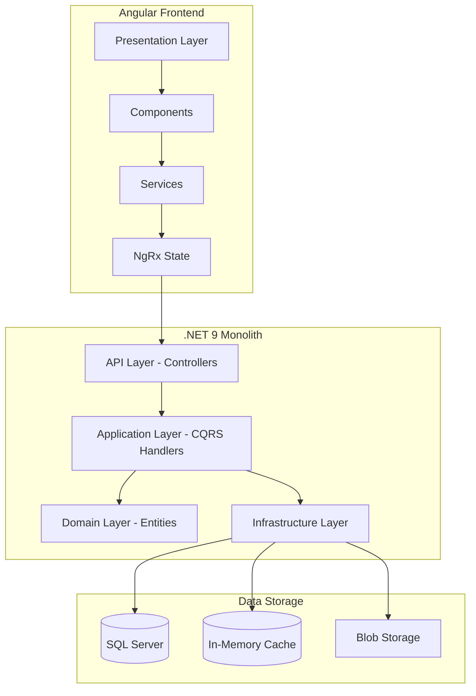
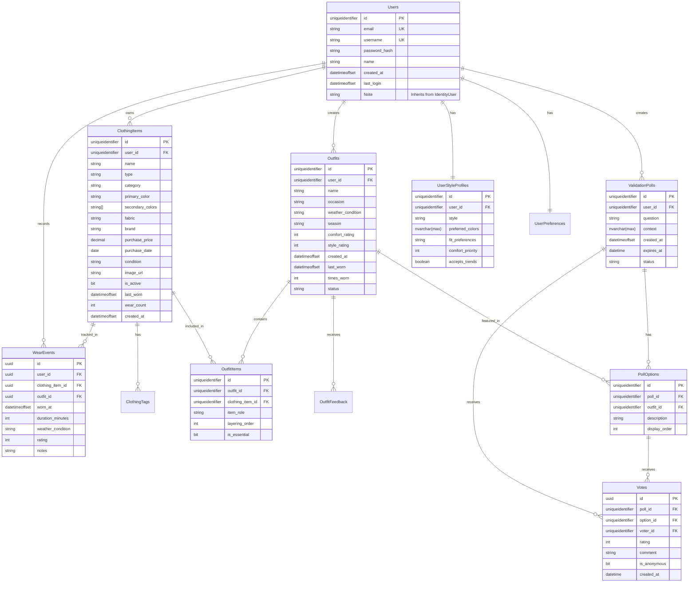

# Outfit Planner - Monolithic Architecture Implementation Plan

## Executive Summary

This document outlines the implementation plan for re-architecting the Outfit Planner application as a standard monolithic web application. The original documentation described a microservices architecture, which has been consolidated into a single deployable unit while maintaining clean separation of concerns through layered architecture.

## Architecture Overview

### Monolithic Architecture Diagram



### Technology Stack

| Layer              | Technology                             |
| ------------------ | -------------------------------------- |
| Backend Framework  | ASP.NET Core 9 Web API                 |
| ORM                | Entity Framework Core 9                |
| Database           | SQL Server                             |
| Caching            | In-Memory Cache / Redis optional       |
| Authentication     | JWT Bearer + ASP.NET Identity          |
| Frontend Framework | Angular 17+                            |
| State Management   | NgRx Store + Effects                   |
| UI Framework       | Bootstrap 5 / Angular Material         |
| Image Storage      | Local File System / Azure Blob Storage |

---

## Project Structure

### Backend Structure - Clean Architecture

```
src/
├── OutfitPlanner.Api/                 # Presentation Layer
│   ├── Controllers/                   # API Endpoints
│   │   ├── AuthController.cs
│   │   ├── WardrobeController.cs
│   │   ├── OutfitsController.cs
│   │   ├── SocialController.cs
│   │   └── WeatherController.cs
│   ├── Middleware/                    # Request Pipeline
│   │   ├── ExceptionMiddleware.cs
│   │   └── RequestLoggingMiddleware.cs
│   ├── Filters/                       # Action Filters
│   └── Program.cs                     # Application Entry
│
├── OutfitPlanner.Application/         # Application Layer
│   ├── Commands/                      # CQRS Commands
│   │   ├── Wardrobe/
│   │   ├── Outfits/
│   │   └── Social/
│   ├── Queries/                       # CQRS Queries
│   ├── Handlers/                      # Command/Query Handlers
│   ├── DTOs/                          # Data Transfer Objects
│   ├── Interfaces/                    # Service Interfaces
│   └── Mappings/                      # AutoMapper Profiles
│
├── OutfitPlanner.Domain/              # Domain Layer
│   ├── Entities/                      # Domain Entities
│   │   ├── User.cs
│   │   ├── ClothingItem.cs
│   │   ├── Outfit.cs
│   │   └── ValidationPoll.cs
│   ├── Enums/                         # Enumerations
│   ├── ValueObjects/                  # Value Objects
│   ├── Interfaces/                    # Repository Interfaces
│   └── Exceptions/                    # Domain Exceptions
│
├── OutfitPlanner.Infrastructure/      # Infrastructure Layer
│   ├── Persistence/                   # Database
│   │   ├── AppDbContext.cs
│   │   ├── Configurations/
│   │   └── Repositories/
│   ├── Services/                      # External Services
│   │   ├── WeatherService.cs
│   │   ├── ImageProcessingService.cs
│   │   └── EmailService.cs
│   └── Security/                      # Security
│       ├── JwtService.cs
│       └── EncryptionService.cs
│
└── tests/                             # Test Projects
    ├── OutfitPlanner.Application.UnitTests/
    └── OutfitPlanner.Application.IntegrationTests/
```

### Frontend Structure - Angular

```
src/outfit-planner-ui/
├── src/app/
│   ├── core/                          # Core Module
│   │   ├── guards/                    # Route Guards
│   │   ├── interceptors/              # HTTP Interceptors
│   │   ├── services/                  # Core Services
│   │   └── models/                    # Shared Models
│   │
│   ├── domain/                        # Domain Layer
│   │   ├── entities/                  # Domain Entities
│   │   ├── repositories/              # Repository Interfaces
│   │   └── usecases/                  # Use Cases
│   │
│   ├── data/                          # Data Layer
│   │   ├── datasources/               # API Data Sources
│   │   ├── repositories/              # Repository Implementations
│   │   └── models/                    # DTOs
│   │
│   ├── presentation/                  # Presentation Layer
│   │   ├── components/                # Reusable Components
│   │   ├── pages/                     # Page Components
│   │   ├── layouts/                   # Layout Components
│   │   └── pipes/                     # Custom Pipes
│   │
│   └── config/                        # App Configuration
│
└── assets/                            # Static Assets
```

---

## Implementation Tasks

### Phase 1: Backend Foundation

#### 1.1 Domain Layer Implementation

- [ ] Create User entity inheriting from IdentityUser with style profile and preferences
- [ ] Create ClothingItem entity with tags and metadata
- [ ] Create Outfit entity with items and relationships
- [ ] Create ValidationPoll entity for social features
- [ ] Create WearEvent entity for tracking
- [ ] Define all enums: ClothingType, OccasionType, Season, StylePreference, PrivacyLevel
- [ ] Create value objects for complex types
- [ ] Define repository interfaces

#### 1.2 Infrastructure Layer Implementation

- [ ] Configure SQL Server DbContext with EF Core
- [ ] Create entity configurations with Fluent API
- [ ] Implement generic repository pattern
- [ ] Implement specific repositories: UserRepository, ClothingItemRepository, OutfitRepository
- [ ] Configure database migrations
- [ ] Implement JWT authentication service
- [ ] Implement password hashing service
- [ ] Implement image storage service

#### 1.3 Application Layer Implementation

- [ ] Set up MediatR for CQRS
- [ ] Configure AutoMapper profiles
- [ ] Create DTOs for all entities
- [ ] Implement authentication commands: Register, Login, RefreshToken
- [ ] Implement wardrobe commands: CreateItem, UpdateItem, DeleteItem
- [ ] Implement wardrobe queries: GetItems, GetItemById, GetAnalysis
- [ ] Implement outfit commands: GenerateOutfits, SaveOutfit, RecordWear
- [ ] Implement social commands: CreatePoll, VoteOnPoll

#### 1.4 API Layer Implementation

- [ ] Configure JWT Bearer authentication
- [ ] Create AuthController with register/login endpoints
- [ ] Create WardrobeController with CRUD endpoints
- [ ] Create OutfitsController with generation endpoints
- [ ] Create SocialController with poll endpoints
- [ ] Create WeatherController for weather data
- [ ] Implement global exception handling middleware
- [ ] Configure Swagger/OpenAPI documentation
- [ ] Add input validation with FluentValidation

### Phase 2: Frontend Foundation

#### 2.1 Core Module Setup

- [ ] Create AuthGuard for protected routes
- [ ] Create AuthInterceptor for JWT tokens
- [ ] Create ErrorInterceptor for error handling
- [ ] Implement AuthService with token management
- [ ] Configure environment settings

#### 2.2 Domain Layer Setup

- [ ] Define all entity interfaces matching backend DTOs
- [ ] Create repository interfaces
- [ ] Define use case classes

#### 2.3 Data Layer Setup

- [ ] Implement API data sources for each entity
- [ ] Implement repository classes
- [ ] Create mappers for DTO to entity conversion

#### 2.4 State Management Setup

- [ ] Configure NgRx Store
- [ ] Create actions for all operations
- [ ] Create reducers for state slices
- [ ] Create effects for side effects
- [ ] Create selectors for data access

### Phase 3: Feature Implementation

#### 3.1 Authentication Feature

- [ ] Backend: Implement user registration with style preferences
- [ ] Backend: Implement login with JWT generation
- [ ] Frontend: Create login page component
- [ ] Frontend: Create registration wizard component
- [ ] Frontend: Implement token refresh mechanism

#### 3.2 Wardrobe Management Feature

- [ ] Backend: Implement clothing item CRUD operations
- [ ] Backend: Implement image upload and processing
- [ ] Backend: Implement wardrobe analytics endpoint
- [ ] Frontend: Create wardrobe grid component
- [ ] Frontend: Create item detail component
- [ ] Frontend: Create upload wizard component
- [ ] Frontend: Create analytics dashboard component

#### 3.3 Outfit Generation Feature

- [ ] Backend: Implement outfit generation algorithm
- [ ] Backend: Implement weather integration service
- [ ] Backend: Implement calendar integration placeholder
- [ ] Backend: Implement outfit scoring system
- [ ] Frontend: Create outfit builder component
- [ ] Frontend: Create daily suggestions component
- [ ] Frontend: Create weather display component
- [ ] Frontend: Create saved outfits component

#### 3.4 Social Validation Feature

- [ ] Backend: Implement poll creation and management
- [ ] Backend: Implement voting system
- [ ] Backend: Implement trend analysis placeholder
- [ ] Frontend: Create poll creator component
- [ ] Frontend: Create vote display component
- [ ] Frontend: Create community feed component

### Phase 4: Integration and Polish

#### 4.1 API Integration

- [ ] Connect frontend services to backend APIs
- [ ] Implement proper error handling
- [ ] Add loading states and indicators
- [ ] Implement optimistic updates where appropriate

#### 4.2 UI/UX Polish

- [ ] Implement responsive design
- [ ] Add animations and transitions
- [ ] Implement accessibility features
- [ ] Add loading skeletons

#### 4.3 Testing

- [ ] Write unit tests for domain entities
- [ ] Write unit tests for application handlers
- [ ] Write integration tests for API endpoints
- [ ] Write component tests for Angular
- [ ] Write E2E tests for critical flows

#### 4.4 Documentation

- [ ] Document API endpoints
- [ ] Document component library
- [ ] Create deployment guide
- [ ] Create user guide

---

## Database Schema

### Entity Relationship Diagram



---

## API Endpoints Summary

### Authentication

| Method | Endpoint             | Description          |
| ------ | -------------------- | -------------------- |
| POST   | `/api/auth/register` | Register new user    |
| POST   | `/api/auth/login`    | Authenticate user    |
| POST   | `/api/auth/refresh`  | Refresh access token |
| POST   | `/api/auth/logout`   | Logout user          |

### Wardrobe Management

| Method | Endpoint                        | Description            |
| ------ | ------------------------------- | ---------------------- |
| GET    | `/api/wardrobe/items`           | Get all clothing items |
| GET    | `/api/wardrobe/items/{id}`      | Get single item        |
| POST   | `/api/wardrobe/items`           | Add new clothing item  |
| PUT    | `/api/wardrobe/items/{id}`      | Update clothing item   |
| DELETE | `/api/wardrobe/items/{id}`      | Delete clothing item   |
| POST   | `/api/wardrobe/items/{id}/wear` | Record item wear       |
| GET    | `/api/wardrobe/analysis`        | Get wardrobe analytics |

### Outfit Management

| Method | Endpoint                 | Description                  |
| ------ | ------------------------ | ---------------------------- |
| GET    | `/api/outfits`           | Get user outfits             |
| GET    | `/api/outfits/{id}`      | Get single outfit            |
| POST   | `/api/outfits/generate`  | Generate outfit suggestions  |
| POST   | `/api/outfits`           | Save new outfit              |
| PUT    | `/api/outfits/{id}`      | Update outfit                |
| DELETE | `/api/outfits/{id}`      | Delete outfit                |
| GET    | `/api/outfits/today`     | Get todays outfit suggestion |
| POST   | `/api/outfits/{id}/wear` | Record outfit wear           |

### Social Features

| Method | Endpoint                      | Description            |
| ------ | ----------------------------- | ---------------------- |
| GET    | `/api/social/polls`           | Get user polls         |
| GET    | `/api/social/polls/{id}`      | Get single poll        |
| POST   | `/api/social/polls`           | Create validation poll |
| POST   | `/api/social/polls/{id}/vote` | Vote on poll           |
| GET    | `/api/social/trends/local`    | Get local trends       |

### Weather

| Method | Endpoint                | Description          |
| ------ | ----------------------- | -------------------- |
| GET    | `/api/weather/current`  | Get current weather  |
| GET    | `/api/weather/forecast` | Get weather forecast |

---

## Key Design Decisions

### 1. Monolithic Architecture Rationale

- **Simplified Deployment**: Single deployment unit reduces operational complexity
- **Reduced Latency**: In-process communication eliminates network overhead
- **Easier Development**: Simpler debugging and local development setup
- **Cost Effective**: Lower infrastructure costs for initial deployment
- **Transaction Management**: ACID transactions across all domain entities

### 2. Clean Architecture Benefits

- **Testability**: Business logic isolated from infrastructure
- **Maintainability**: Clear separation of concerns
- **Flexibility**: Can evolve to microservices if needed
- **Independence**: Domain layer has no external dependencies

### 3. CQRS Pattern

- **Performance**: Optimized read and write paths
- **Scalability**: Can scale queries independently
- **Clarity**: Clear intent for each operation
- **Validation**: Command-specific validation rules

### 4. Angular Architecture

- **Domain-Driven**: Frontend mirrors backend domain structure
- **Reactive State**: Predictable state management with NgRx
- **Modularity**: Feature-based organization
- **Testability**: Dependency injection enables easy mocking

---

## Development Workflow

### Getting Started

1. Clone repository
2. Configure SQL Server connection string in `appsettings.json`
3. Run `dotnet ef database update` to create database
4. Run `dotnet run` from `src/OutfitPlanner.Api`
5. Navigate to `src/outfit-planner-ui`
6. Run `npm install`
7. Run `ng serve`

### Development Commands

```bash
# Backend
dotnet build                          # Build solution
dotnet test                           # Run tests
dotnet ef migrations add <Name>       # Create migration
dotnet ef database update             # Apply migrations

# Frontend
npm start                             # Start dev server
npm test                              # Run unit tests
npm run build                         # Production build
```

---

## Next Steps

1. **Review and approve this plan**
2. **Switch to Code mode for implementation**
3. **Begin with Phase 1: Backend Foundation**
4. **Iterate through each phase sequentially**

---

## Questions for Clarification

Before proceeding with implementation, please confirm:

1. **Image Storage**: Should we use local file system storage or configure Azure Blob Storage from the start?

2. **Weather API**: Do you have an OpenWeatherMap API key, or should we use a mock service initially?

3. **AI/ML Features**: Should we implement placeholder services for AI tagging and outfit scoring, or skip these features initially?

4. **Calendar Integration**: Should we implement Google/Microsoft calendar integration, or defer this feature?

5. **Email Service**: Is email verification required for registration, or can we implement basic auth without email confirmation?
