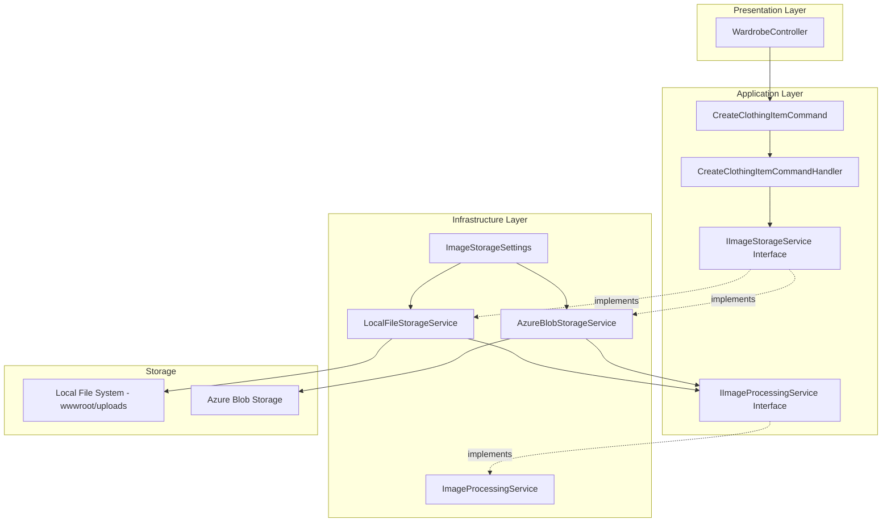

# Task 3: Image Storage Service Implementation - Detailed Guide

## Executive Summary

This document provides a comprehensive implementation guide for the Image Storage Service in the Outfit Planner application. The service handles image upload, processing, storage, and retrieval for clothing items.

---

## Table of Contents

1. [Architecture Overview](#architecture-overview)
2. [Files to Create](#files-to-create)
3. [Interface Definitions](#interface-definitions)
4. [Configuration Classes](#configuration-classes)
5. [Image Processing Service](#image-processing-service)
6. [Local File Storage Service](#local-file-storage-service)
7. [Azure Blob Storage Service](#azure-blob-storage-service)
8. [Service Registration](#service-registration)
9. [Integration with CQRS Handlers](#integration-with-cqrs-handlers)
10. [API Controller Integration](#api-controller-integration)
11. [Testing Strategy](#testing-strategy)

---

## Architecture Overview



---

## Files to Create

### Directory Structure

```
src/
├── OutfitPlanner.Application/
│   └── Contracts/
│       └── Infrastructure/
│           ├── IImageStorageService.cs
│           ├── IImageProcessingService.cs
│           └── Models/
│               ├── ImageUploadResult.cs
│               ├── ProcessedImage.cs
│               └── ImageMetadata.cs
│
├── OutfitPlanner.Infrastructure/
│   ├── Configuration/
│   │   └── ImageStorageSettings.cs
│   └── Services/
│       ├── ImageProcessingService.cs
│       ├── LocalFileStorageService.cs
│       └── AzureBlobStorageService.cs
```

---

## Interface Definitions

### File: `src/OutfitPlanner.Application/Contracts/Infrastructure/IImageStorageService.cs`

```csharp
using OutfitPlanner.Application.Contracts.Infrastructure.Models;

namespace OutfitPlanner.Application.Contracts.Infrastructure;

/// <summary>
/// Provides image storage capabilities for clothing items.
/// Abstracts the underlying storage mechanism - local file system or cloud storage.
/// </summary>
public interface IImageStorageService
{
    /// <summary>
    /// Uploads an image stream and stores it with multiple sizes.
    /// </summary>
    /// <param name="imageStream">The image data as a stream</param>
    /// <param name="fileName">Original file name for extension detection</param>
    /// <param name="userId">User ID for folder organization</param>
    /// <param name="cancellationToken">Cancellation token</param>
    /// <returns>Result containing paths to all generated image sizes</returns>
    Task<ImageUploadResult> UploadImageAsync(
        Stream imageStream,
        string fileName,
        string userId,
        CancellationToken cancellationToken = default);

    /// <summary>
    /// Deletes an image and all its variants from storage.
    /// </summary>
    /// <param name="imagePath">Primary path of the image</param>
    /// <param name="cancellationToken">Cancellation token</param>
    /// <returns>True if deletion was successful</returns>
    Task<bool> DeleteImageAsync(
        string imagePath,
        CancellationToken cancellationToken = default);

    /// <summary>
    /// Gets the full accessible URL for an image path.
    /// </summary>
    /// <param name="imagePath">Relative path stored in database</param>
    /// <returns>Full URL to access the image</returns>
    string GetImageUrl(string imagePath);

    /// <summary>
    /// Gets the thumbnail URL for an image path.
    /// </summary>
    /// <param name="imagePath">Original image path</param>
    /// <returns>Thumbnail URL</returns>
    string GetThumbnailUrl(string imagePath);

    /// <summary>
    /// Checks if an image exists at the specified path.
    /// </summary>
    /// <param name="imagePath">Path to check</param>
    /// <param name="cancellationToken">Cancellation token</param>
    /// <returns>True if image exists</returns>
    Task<bool> ImageExistsAsync(
        string imagePath,
        CancellationToken cancellationToken = default);

    /// <summary>
    /// Validates an image before upload.
    /// </summary>
    /// <param name="imageStream">Image stream to validate</param>
    /// <param name="fileName">File name for extension validation</param>
    /// <returns>Validation result with any error messages</returns>
    ImageValidationResult ValidateImage(Stream imageStream, string fileName);
}
```

### File: `src/OutfitPlanner.Application/Contracts/Infrastructure/IImageProcessingService.cs`

```csharp
using OutfitPlanner.Application.Contracts.Infrastructure.Models;

namespace OutfitPlanner.Application.Contracts.Infrastructure;

/// <summary>
/// Provides image processing capabilities - resizing, compression, and metadata extraction.
/// </summary>
public interface IImageProcessingService
{
    /// <summary>
    /// Processes an image and generates multiple sizes.
    /// </summary>
    /// <param name="imageStream">Original image stream</param>
    /// <param name="fileName">File name for output naming</param>
    /// <param name="cancellationToken">Cancellation token</param>
    /// <returns>Processed image with all size variants</returns>
    Task<ProcessedImage> ProcessImageAsync(
        Stream imageStream,
        string fileName,
        CancellationToken cancellationToken = default);

    /// <summary>
    /// Resizes an image to specified dimensions while maintaining aspect ratio.
    /// </summary>
    /// <param name="imageStream">Original image stream</param>
    /// <param name="maxWidth">Maximum width</param>
    /// <param name="maxHeight">Maximum height</param>
    /// <param name="quality">JPEG quality 1-100</param>
    /// <param name="cancellationToken">Cancellation token</param>
    /// <returns>Resized image stream</returns>
    Task<Stream> ResizeImageAsync(
        Stream imageStream,
        int maxWidth,
        int maxHeight,
        int quality = 85,
        CancellationToken cancellationToken = default);

    /// <summary>
    /// Extracts metadata from an image.
    /// </summary>
    /// <param name="imageStream">Image stream to analyze</param>
    /// <param name="cancellationToken">Cancellation token</param>
    /// <returns>Image metadata</returns>
    Task<ImageMetadata> GetMetadataAsync(
        Stream imageStream,
        CancellationToken cancellationToken = default);

    /// <summary>
    /// Converts an image to JPEG format.
    /// </summary>
    /// <param name="imageStream">Original image stream</param>
    /// <param name="quality">JPEG quality 1-100</param>
    /// <param name="cancellationToken">Cancellation token</param>
    /// <returns>JPEG image stream</returns>
    Task<Stream> ConvertToJpegAsync(
        Stream imageStream,
        int quality = 85,
        CancellationToken cancellationToken = default);
}
```

### File: `src/OutfitPlanner.Application/Contracts/Infrastructure/Models/ImageUploadResult.cs`

```csharp
namespace OutfitPlanner.Application.Contracts.Infrastructure.Models;

/// <summary>
/// Result of an image upload operation.
/// </summary>
public record ImageUploadResult
{
    /// <summary>
    /// Indicates if the upload was successful.
    /// </summary>
    public bool Success { get; init; }

    /// <summary>
    /// Path to the original full-size image.
    /// </summary>
    public string? OriginalPath { get; init; }

    /// <summary>
    /// Path to the thumbnail version - 150x150.
    /// </summary>
    public string? ThumbnailPath { get; init; }

    /// <summary>
    /// Path to the medium version - 400x400.
    /// </summary>
    public string? MediumPath { get; init; }

    /// <summary>
    /// Path to the large version - 800x800.
    /// </summary>
    public string? LargePath { get; init; }

    /// <summary>
    /// Error message if upload failed.
    /// </summary>
    public string? ErrorMessage { get; init; }

    /// <summary>
    /// Original file size in bytes.
    /// </summary>
    public long FileSizeBytes { get; init; }

    /// <summary>
    /// Image width in pixels.
    /// </summary>
    public int Width { get; init; }

    /// <summary>
    /// Image height in pixels.
    /// </summary>
    public int Height { get; init; }

    /// <summary>
    /// Unique identifier for the uploaded image.
    /// </summary>
    public Guid ImageId { get; init; }

    /// <summary>
    /// Creates a successful result.
    /// </summary>
    public static ImageUploadResult Successful(
        string originalPath,
        string thumbnailPath,
        string mediumPath,
        string largePath,
        long fileSize,
        int width,
        int height,
        Guid imageId) => new()
        {
            Success = true,
            OriginalPath = originalPath,
            ThumbnailPath = thumbnailPath,
            MediumPath = mediumPath,
            LargePath = largePath,
            FileSizeBytes = fileSize,
            Width = width,
            Height = height,
            ImageId = imageId
        };

    /// <summary>
    /// Creates a failed result.
    /// </summary>
    public static ImageUploadResult Failed(string errorMessage) => new()
    {
        Success = false,
        ErrorMessage = errorMessage
    };
}
```

### File: `src/OutfitPlanner.Application/Contracts/Infrastructure/Models/ProcessedImage.cs`

```csharp
namespace OutfitPlanner.Application.Contracts.Infrastructure.Models;

/// <summary>
/// Contains all size variants of a processed image.
/// </summary>
public class ProcessedImage : IDisposable
{
    /// <summary>
    /// Original image stream.
    /// </summary>
    public Stream Original { get; set; } = Stream.Null;

    /// <summary>
    /// Thumbnail size stream - 150x150 pixels.
    /// </summary>
    public Stream Thumbnail { get; set; } = Stream.Null;

    /// <summary>
    /// Medium size stream - 400x400 pixels.
    /// </summary>
    public Stream Medium { get; set; } = Stream.Null;

    /// <summary>
    /// Large size stream - 800x800 pixels.
    /// </summary>
    public Stream Large { get; set; } = Stream.Null;

    /// <summary>
    /// Generated file name without extension.
    /// </summary>
    public string FileName { get; set; } = string.Empty;

    /// <summary>
    /// File extension - .jpg, .png, etc.
    /// </summary>
    public string Extension { get; set; } = ".jpg";

    /// <summary>
    /// Image metadata.
    /// </summary>
    public ImageMetadata Metadata { get; set; } = new();

    /// <summary>
    /// Unique identifier for this image set.
    /// </summary>
    public Guid ImageId { get; set; } = Guid.NewGuid();

    public void Dispose()
    {
        Original?.Dispose();
        Thumbnail?.Dispose();
        Medium?.Dispose();
        Large?.Dispose();
    }
}
```

### File: `src/OutfitPlanner.Application/Contracts/Infrastructure/Models/ImageMetadata.cs`

```csharp
namespace OutfitPlanner.Application.Contracts.Infrastructure.Models;

/// <summary>
/// Metadata extracted from an image.
/// </summary>
public record ImageMetadata
{
    /// <summary>
    /// Image width in pixels.
    /// </summary>
    public int Width { get; init; }

    /// <summary>
    /// Image height in pixels.
    /// </summary>
    public int Height { get; init; }

    /// <summary>
    /// Image format - JPEG, PNG, WebP, etc.
    /// </summary>
    public string Format { get; init; } = string.Empty;

    /// <summary>
    /// File size in bytes.
    /// </summary>
    public long SizeBytes { get; init; }

    /// <summary>
    /// Bits per pixel.
    /// </summary>
    public int BitsPerPixel { get; init; }

    /// <summary>
    /// Whether the image has transparency.
    /// </summary>
    public bool HasTransparency { get; init; }

    /// <summary>
    /// DPI horizontal resolution.
    /// </summary>
    public double DpiX { get; init; }

    /// <summary>
    /// DPI vertical resolution.
    /// </summary>
    public double DpiY { get; init; }
}
```

### File: `src/OutfitPlanner.Application/Contracts/Infrastructure/Models/ImageValidationResult.cs`

```csharp
namespace OutfitPlanner.Application.Contracts.Infrastructure.Models;

/// <summary>
/// Result of image validation.
/// </summary>
public record ImageValidationResult
{
    /// <summary>
    /// Indicates if the image is valid.
    /// </summary>
    public bool IsValid { get; init; }

    /// <summary>
    /// List of validation errors.
    /// </summary>
    public List<string> Errors { get; init; } = new();

    /// <summary>
    /// Creates a successful validation result.
    /// </summary>
    public static ImageValidationResult Valid() => new() { IsValid = true };

    /// <summary>
    /// Creates a failed validation result.
    /// </summary>
    public static ImageValidationResult Invalid(params string[] errors) => new()
    {
        IsValid = false,
        Errors = errors.ToList()
    };
}
```

---

## Configuration Classes

### File: `src/OutfitPlanner.Infrastructure/Configuration/ImageStorageSettings.cs`

```csharp
namespace OutfitPlanner.Infrastructure.Configuration;

/// <summary>
/// Configuration settings for image storage.
/// </summary>
public class ImageStorageSettings
{
    /// <summary>
    /// Configuration section name in appsettings.json.
    /// </summary>
    public const string SectionName = "ImageStorage";

    /// <summary>
    /// Storage provider to use.
    /// </summary>
    public StorageProvider Provider { get; set; } = StorageProvider.LocalFileSystem;

    /// <summary>
    /// Local file system storage path - relative to wwwroot.
    /// </summary>
    public string LocalStoragePath { get; set; } = "uploads";

    /// <summary>
    /// Azure Blob Storage connection string.
    /// Required when Provider is AzureBlobStorage.
    /// </summary>
    public string? AzureConnectionString { get; set; }

    /// <summary>
    /// Azure Blob Storage container name.
    /// </summary>
    public string AzureContainerName { get; set; } = "clothing-images";

    /// <summary>
    /// Maximum file size in bytes. Default: 10MB.
    /// </summary>
    public int MaxFileSizeBytes { get; set; } = 10 * 1024 * 1024;

    /// <summary>
    /// Allowed file extensions.
    /// </summary>
    public List<string> AllowedExtensions { get; set; } = new() { ".jpg", ".jpeg", ".png", ".webp" };

    /// <summary>
    /// Allowed MIME types.
    /// </summary>
    public List<string> AllowedMimeTypes { get; set; } = new()
    {
        "image/jpeg",
        "image/png",
        "image/webp"
    };

    /// <summary>
    /// Thumbnail generation settings.
    /// </summary>
    public ThumbnailSettings Thumbnails { get; set; } = new();

    /// <summary>
    /// Base URL for serving images - used for generating full URLs.
    /// </summary>
    public string? BaseUrl { get; set; }
}

/// <summary>
/// Storage provider options.
/// </summary>
public enum StorageProvider
{
    /// <summary>
    /// Store images on local file system.
    /// </summary>
    LocalFileSystem,

    /// <summary>
    /// Store images in Azure Blob Storage.
    /// </summary>
    AzureBlobStorage
}

/// <summary>
/// Thumbnail size and quality settings.
/// </summary>
public class ThumbnailSettings
{
    /// <summary>
    /// Thumbnail size - used for grid views and cards.
    /// </summary>
    public int ThumbnailSize { get; set; } = 150;

    /// <summary>
    /// Medium size - used for detail previews.
    /// </summary>
    public int MediumSize { get; set; } = 400;

    /// <summary>
    /// Large size - used for full detail views.
    /// </summary>
    public int LargeSize { get; set; } = 800;

    /// <summary>
    /// JPEG quality for thumbnails - 1 to 100.
    /// </summary>
    public int ThumbnailQuality { get; set; } = 75;

    /// <summary>
    /// JPEG quality for medium images - 1 to 100.
    /// </summary>
    public int MediumQuality { get; set; } = 85;

    /// <summary>
    /// JPEG quality for large images - 1 to 100.
    /// </summary>
    public int LargeQuality { get; set; } = 90;

    /// <summary>
    /// Whether to maintain aspect ratio.
    /// </summary>
    public bool MaintainAspectRatio { get; set; } = true;

    /// <summary>
    /// Background color for padding if aspect ratio is maintained.
    /// </summary>
    public string PaddingColor { get; set; } = "#FFFFFF";
}
```

---

## Image Processing Service

### File: `src/OutfitPlanner.Infrastructure/Services/ImageProcessingService.cs`

```csharp
using SixLabors.ImageSharp;
using SixLabors.ImageSharp.Formats.Jpeg;
using SixLabors.ImageSharp.Processing;
using SixLabors.ImageSharp.Metadata;
using OutfitPlanner.Application.Contracts.Infrastructure;
using OutfitPlanner.Application.Contracts.Infrastructure.Models;
using OutfitPlanner.Infrastructure.Configuration;
using Microsoft.Extensions.Logging;

namespace OutfitPlanner.Infrastructure.Services;

/// <summary>
/// Implementation of image processing using ImageSharp.
/// Handles resizing, compression, and metadata extraction.
/// </summary>
public class ImageProcessingService : IImageProcessingService
{
    private readonly ImageStorageSettings _settings;
    private readonly ILogger<ImageProcessingService> _logger;

    public ImageProcessingService(
        ImageStorageSettings settings,
        ILogger<ImageProcessingService> logger)
    {
        _settings = settings;
        _logger = logger;
    }

    /// <inheritdoc />
    public async Task<ProcessedImage> ProcessImageAsync(
        Stream imageStream,
        string fileName,
        CancellationToken cancellationToken = default)
    {
        _logger.LogInformation("Processing image: {FileName}", fileName);

        try
        {
            // Load the original image
            using var originalImage = await Image.LoadAsync(imageStream, cancellationToken);

            var imageId = Guid.NewGuid();
            var extension = Path.GetExtension(fileName);
            var baseFileName = Path.GetFileNameWithoutExtension(fileName);
            var generatedFileName = $"{imageId}_{baseFileName}";

            var result = new ProcessedImage
            {
                FileName = generatedFileName,
                Extension = ".jpg", // Always convert to JPEG for consistency
                ImageId = imageId,
                Metadata = ExtractMetadata(originalImage, imageStream.Length)
            };

            // Generate thumbnail
            result.Thumbnail = await ResizeToStreamAsync(
                originalImage,
                _settings.Thumbnails.ThumbnailSize,
                _settings.Thumbnails.ThumbnailSize,
                _settings.Thumbnails.ThumbnailQuality,
                cancellationToken);

            // Generate medium
            result.Medium = await ResizeToStreamAsync(
                originalImage,
                _settings.Thumbnails.MediumSize,
                _settings.Thumbnails.MediumSize,
                _settings.Thumbnails.MediumQuality,
                cancellationToken);

            // Generate large
            result.Large = await ResizeToStreamAsync(
                originalImage,
                _settings.Thumbnails.LargeSize,
                _settings.Thumbnails.LargeSize,
                _settings.Thumbnails.LargeQuality,
                cancellationToken);

            // Store original - convert to JPEG for consistency
            result.Original = await ConvertToJpegAsync(
                imageStream,
                _settings.Thumbnails.LargeQuality,
                cancellationToken);

            _logger.LogInformation(
                "Image processed successfully: {FileName}, Original size: {Width}x{Height}",
                fileName, result.Metadata.Width, result.Metadata.Height);

            return result;
        }
        catch (Exception ex)
        {
            _logger.LogError(ex, "Failed to process image: {FileName}", fileName);
            throw;
        }
    }

    /// <inheritdoc />
    public async Task<Stream> ResizeImageAsync(
        Stream imageStream,
        int maxWidth,
        int maxHeight,
        int quality = 85,
        CancellationToken cancellationToken = default)
    {
        imageStream.Position = 0;
        using var image = await Image.LoadAsync(imageStream, cancellationToken);

        return await ResizeToStreamAsync(image, maxWidth, maxHeight, quality, cancellationToken);
    }

    /// <inheritdoc />
    public async Task<ImageMetadata> GetMetadataAsync(
        Stream imageStream,
        CancellationToken cancellationToken = default)
    {
        imageStream.Position = 0;
        using var image = await Image.LoadAsync(imageStream, cancellationToken);

        return ExtractMetadata(image, imageStream.Length);
    }

    /// <inheritdoc />
    public async Task<Stream> ConvertToJpegAsync(
        Stream imageStream,
        int quality = 85,
        CancellationToken cancellationToken = default)
    {
        imageStream.Position = 0;
        using var image = await Image.LoadAsync(imageStream, cancellationToken);

        var outputStream = new MemoryStream();
        var encoder = new JpegEncoder { Quality = quality };
        await image.SaveAsync(outputStream, encoder, cancellationToken);
        outputStream.Position = 0;

        return outputStream;
    }

    /// <summary>
    /// Resizes an image to the specified dimensions and returns as a stream.
    /// </summary>
    private async Task<Stream> ResizeToStreamAsync(
        Image image,
        int maxWidth,
        int maxHeight,
        int quality,
        CancellationToken cancellationToken)
    {
        var outputStream = new MemoryStream();

        // Clone the image for resizing
        using var clone = image.Clone(context =>
        {
            context.Resize(new ResizeOptions
            {
                Size = new Size(maxWidth, maxHeight),
                Mode = _settings.Thumbnails.MaintainAspectRatio
                    ? ResizeMode.Max  // Maintains aspect ratio, fits within bounds
                    : ResizeMode.Stretch, // Stretches to exact size
                Sampler = KnownResamplers.Lanczos3 // High quality resampling
            });
        });

        var encoder = new JpegEncoder { Quality = quality };
        await clone.SaveAsync(outputStream, encoder, cancellationToken);
        outputStream.Position = 0;

        return outputStream;
    }

    /// <summary>
    /// Extracts metadata from an image.
    /// </summary>
    private ImageMetadata ExtractMetadata(Image image, long streamLength)
    {
        var metadata = image.Metadata;

        return new ImageMetadata
        {
            Width = image.Width,
            Height = image.Height,
            Format = image.Metadata.DecodedImageFormat?.Name ?? "Unknown",
            SizeBytes = streamLength,
            BitsPerPixel = image.PixelType.BitsPerPixel,
            HasTransparency = image.PixelAlphaRepresentation != PixelAlphaRepresentation.None,
            DpiX = metadata.HorizontalResolution,
            DpiY = metadata.VerticalResolution
        };
    }
}
```

---

## Local File Storage Service

### File: `src/OutfitPlanner.Infrastructure/Services/LocalFileStorageService.cs`

```csharp
using OutfitPlanner.Application.Contracts.Infrastructure;
using OutfitPlanner.Application.Contracts.Infrastructure.Models;
using OutfitPlanner.Infrastructure.Configuration;
using Microsoft.Extensions.Hosting;
using Microsoft.Extensions.Logging;
using Microsoft.AspNetCore.Hosting;

namespace OutfitPlanner.Infrastructure.Services;

/// <summary>
/// Local file system implementation of image storage.
/// Stores images in wwwroot/uploads/{userId}/{imageId}/ folder structure.
/// </summary>
public class LocalFileStorageService : IImageStorageService
{
    private readonly IImageProcessingService _imageProcessor;
    private readonly ImageStorageSettings _settings;
    private readonly IWebHostEnvironment _environment;
    private readonly ILogger<LocalFileStorageService> _logger;

    // Size suffixes for file naming
    private const string OriginalSuffix = "";
    private const string ThumbnailSuffix = "_thumb";
    private const string MediumSuffix = "_medium";
    private const string LargeSuffix = "_large";

    public LocalFileStorageService(
        IImageProcessingService imageProcessor,
        ImageStorageSettings settings,
        IWebHostEnvironment environment,
        ILogger<LocalFileStorageService> logger)
    {
        _imageProcessor = imageProcessor;
        _settings = settings;
        _environment = environment;
        _logger = logger;
    }

    /// <inheritdoc />
    public async Task<ImageUploadResult> UploadImageAsync(
        Stream imageStream,
        string fileName,
        string userId,
        CancellationToken cancellationToken = default)
    {
        _logger.LogInformation("Uploading image: {FileName} for user: {UserId}", fileName, userId);

        try
        {
            // Validate the image first
            var validation = ValidateImage(imageStream, fileName);
            if (!validation.IsValid)
            {
                return ImageUploadResult.Failed(string.Join(", ", validation.Errors));
            }

            // Process the image - generates all sizes
            using var processedImage = await _imageProcessor.ProcessImageAsync(
                imageStream,
                fileName,
                cancellationToken);

            // Create folder structure: uploads/{userId}/{imageId}/
            var uploadFolder = Path.Combine(
                _environment.WebRootPath,
                _settings.LocalStoragePath,
                userId,
                processedImage.ImageId.ToString());

            Directory.CreateDirectory(uploadFolder);

            // Save all image variants
            var baseFileName = processedImage.FileName;

            var originalPath = await SaveImageAsync(
                processedImage.Original,
                uploadFolder,
                $"{baseFileName}{OriginalSuffix}.jpg",
                cancellationToken);

            var thumbnailPath = await SaveImageAsync(
                processedImage.Thumbnail,
                uploadFolder,
                $"{baseFileName}{ThumbnailSuffix}.jpg",
                cancellationToken);

            var mediumPath = await SaveImageAsync(
                processedImage.Medium,
                uploadFolder,
                $"{baseFileName}{MediumSuffix}.jpg",
                cancellationToken);

            var largePath = await SaveImageAsync(
                processedImage.Large,
                uploadFolder,
                $"{baseFileName}{LargeSuffix}.jpg",
                cancellationToken);

            // Return relative paths for database storage
            var relativeBase = $"{_settings.LocalStoragePath}/{userId}/{processedImage.ImageId}";

            _logger.LogInformation(
                "Image uploaded successfully: {ImageId} for user: {UserId}",
                processedImage.ImageId, userId);

            return ImageUploadResult.Successful(
                originalPath: $"{relativeBase}/{baseFileName}.jpg",
                thumbnailPath: $"{relativeBase}/{baseFileName}{ThumbnailSuffix}.jpg",
                mediumPath: $"{relativeBase}/{baseFileName}{MediumSuffix}.jpg",
                largePath: $"{relativeBase}/{baseFileName}{LargeSuffix}.jpg",
                fileSize: processedImage.Metadata.SizeBytes,
                width: processedImage.Metadata.Width,
                height: processedImage.Metadata.Height,
                imageId: processedImage.ImageId);
        }
        catch (Exception ex)
        {
            _logger.LogError(ex, "Failed to upload image: {FileName}", fileName);
            return ImageUploadResult.Failed($"Upload failed: {ex.Message}");
        }
    }

    /// <inheritdoc />
    public Task<bool> DeleteImageAsync(
        string imagePath,
        CancellationToken cancellationToken = default)
    {
        _logger.LogInformation("Deleting image: {ImagePath}", imagePath);

        try
        {
            // Extract folder path from image path
            // Path format: uploads/{userId}/{imageId}/{filename}.jpg
            var pathParts = imagePath.Split('/');
            if (pathParts.Length >= 3)
            {
                var folderPath = Path.Combine(
                    _environment.WebRootPath,
                    pathParts[0], // uploads
                    pathParts[1], // userId
                    pathParts[2]); // imageId

                if (Directory.Exists(folderPath))
                {
                    Directory.Delete(folderPath, recursive: true);
                    _logger.LogInformation("Image folder deleted: {FolderPath}", folderPath);
                    return Task.FromResult(true);
                }
            }

            _logger.LogWarning("Image folder not found: {ImagePath}", imagePath);
            return Task.FromResult(false);
        }
        catch (Exception ex)
        {
            _logger.LogError(ex, "Failed to delete image: {ImagePath}", imagePath);
            return Task.FromResult(false);
        }
    }

    /// <inheritdoc />
    public string GetImageUrl(string imagePath)
    {
        if (string.IsNullOrEmpty(imagePath))
            return string.Empty;

        // If base URL is configured, prepend it
        if (!string.IsNullOrEmpty(_settings.BaseUrl))
        {
            return $"{_settings.BaseUrl.TrimEnd('/')}/{imagePath}";
        }

        // Otherwise return relative path
        return $"/{imagePath}";
    }

    /// <inheritdoc />
    public string GetThumbnailUrl(string imagePath)
    {
        if (string.IsNullOrEmpty(imagePath))
            return string.Empty;

        // Replace the filename to point to thumbnail version
        var directory = Path.GetDirectoryName(imagePath)?.Replace("\\", "/");
        var fileName = Path.GetFileNameWithoutExtension(imagePath);

        return $"{directory}/{fileName}{ThumbnailSuffix}.jpg";
    }

    /// <inheritdoc />
    public Task<bool> ImageExistsAsync(
        string imagePath,
        CancellationToken cancellationToken = default)
    {
        var fullPath = Path.Combine(_environment.WebRootPath, imagePath);
        return Task.FromResult(File.Exists(fullPath));
    }

    /// <inheritdoc />
    public ImageValidationResult ValidateImage(Stream imageStream, string fileName)
    {
        var errors = new List<string>();

        // Validate file extension
        var extension = Path.GetExtension(fileName).ToLowerInvariant();
        if (!_settings.AllowedExtensions.Contains(extension))
        {
            errors.Add($"File extension '{extension}' is not allowed. Allowed extensions: {string.Join(", ", _settings.AllowedExtensions)}");
        }

        // Validate file size
        if (imageStream.Length > _settings.MaxFileSizeBytes)
        {
            var maxSizeMB = _settings.MaxFileSizeBytes / (1024 * 1024);
            errors.Add($"File size exceeds maximum allowed size of {maxSizeMB}MB");
        }

        // Validate image can be loaded
        try
        {
            imageStream.Position = 0;
            using var image = SixLabors.ImageSharp.Image.Load(imageStream);

            // Validate minimum dimensions
            if (image.Width < 50 || image.Height < 50)
            {
                errors.Add("Image dimensions must be at least 50x50 pixels");
            }

            // Validate maximum dimensions
            if (image.Width > 4000 || image.Height > 4000)
            {
                errors.Add("Image dimensions must not exceed 4000x4000 pixels");
            }
        }
        catch (Exception ex)
        {
            errors.Add($"Invalid image file: {ex.Message}");
        }

        return errors.Count == 0
            ? ImageValidationResult.Valid()
            : ImageValidationResult.Invalid(errors.ToArray());
    }

    /// <summary>
    /// Saves an image stream to disk.
    /// </summary>
    private async Task<string> SaveImageAsync(
        Stream imageStream,
        string folderPath,
        string fileName,
        CancellationToken cancellationToken)
    {
        var filePath = Path.Combine(folderPath, fileName);
        imageStream.Position = 0;

        using var fileStream = new FileStream(filePath, FileMode.Create, FileAccess.Write);
        await imageStream.CopyToAsync(fileStream, cancellationToken);

        return filePath;
    }
}
```

---

## Azure Blob Storage Service

### File: `src/OutfitPlanner.Infrastructure/Services/AzureBlobStorageService.cs`

```csharp
using Azure.Storage.Blobs;
using Azure.Storage.Blobs.Models;
using OutfitPlanner.Application.Contracts.Infrastructure;
using OutfitPlanner.Application.Contracts.Infrastructure.Models;
using OutfitPlanner.Infrastructure.Configuration;
using Microsoft.Extensions.Logging;

namespace OutfitPlanner.Infrastructure.Services;

/// <summary>
/// Azure Blob Storage implementation of image storage.
/// Stores images in Azure Blob Storage with container per environment.
/// </summary>
public class AzureBlobStorageService : IImageStorageService
{
    private readonly BlobServiceClient _blobServiceClient;
    private readonly IImageProcessingService _imageProcessor;
    private readonly ImageStorageSettings _settings;
    private readonly ILogger<AzureBlobStorageService> _logger;

    private BlobContainerClient? _containerClient;

    private const string OriginalSuffix = "";
    private const string ThumbnailSuffix = "_thumb";
    private const string MediumSuffix = "_medium";
    private const string LargeSuffix = "_large";

    public AzureBlobStorageService(
        BlobServiceClient blobServiceClient,
        IImageProcessingService imageProcessor,
        ImageStorageSettings settings,
        ILogger<AzureBlobStorageService> logger)
    {
        _blobServiceClient = blobServiceClient;
        _imageProcessor = imageProcessor;
        _settings = settings;
        _logger = logger;
    }

    /// <inheritdoc />
    public async Task<ImageUploadResult> UploadImageAsync(
        Stream imageStream,
        string fileName,
        string userId,
        CancellationToken cancellationToken = default)
    {
        _logger.LogInformation("Uploading image to Azure Blob: {FileName} for user: {UserId}", fileName, userId);

        try
        {
            // Validate the image first
            var validation = ValidateImage(imageStream, fileName);
            if (!validation.IsValid)
            {
                return ImageUploadResult.Failed(string.Join(", ", validation.Errors));
            }

            // Ensure container exists
            var containerClient = await GetContainerClientAsync(cancellationToken);

            // Process the image
            using var processedImage = await _imageProcessor.ProcessImageAsync(
                imageStream,
                fileName,
                cancellationToken);

            // Blob path structure: {userId}/{imageId}/{filename}.jpg
            var baseFileName = processedImage.FileName;
            var blobFolder = $"{userId}/{processedImage.ImageId}";

            // Upload all variants
            var originalPath = await UploadBlobAsync(
                containerClient,
                processedImage.Original,
                $"{blobFolder}/{baseFileName}{OriginalSuffix}.jpg",
                cancellationToken);

            var thumbnailPath = await UploadBlobAsync(
                containerClient,
                processedImage.Thumbnail,
                $"{blobFolder}/{baseFileName}{ThumbnailSuffix}.jpg",
                cancellationToken);

            var mediumPath = await UploadBlobAsync(
                containerClient,
                processedImage.Medium,
                $"{blobFolder}/{baseFileName}{MediumSuffix}.jpg",
                cancellationToken);

            var largePath = await UploadBlobAsync(
                containerClient,
                processedImage.Large,
                $"{blobFolder}/{baseFileName}{LargeSuffix}.jpg",
                cancellationToken);

            _logger.LogInformation(
                "Image uploaded to Azure Blob successfully: {ImageId} for user: {UserId}",
                processedImage.ImageId, userId);

            return ImageUploadResult.Successful(
                originalPath: originalPath,
                thumbnailPath: thumbnailPath,
                mediumPath: mediumPath,
                largePath: largePath,
                fileSize: processedImage.Metadata.SizeBytes,
                width: processedImage.Metadata.Width,
                height: processedImage.Metadata.Height,
                imageId: processedImage.ImageId);
        }
        catch (Exception ex)
        {
            _logger.LogError(ex, "Failed to upload image to Azure Blob: {FileName}", fileName);
            return ImageUploadResult.Failed($"Upload failed: {ex.Message}");
        }
    }

    /// <inheritdoc />
    public async Task<bool> DeleteImageAsync(
        string imagePath,
        CancellationToken cancellationToken = default)
    {
        _logger.LogInformation("Deleting image from Azure Blob: {ImagePath}", imagePath);

        try
        {
            var containerClient = await GetContainerClientAsync(cancellationToken);

            // Delete all blobs in the folder
            var pathParts = imagePath.Split('/');
            if (pathParts.Length >= 2)
            {
                var folderPrefix = $"{pathParts[0]}/{pathParts[1]}/";

                await foreach (var blob in containerClient.GetBlobsAsync(
                    prefix: folderPrefix,
                    cancellationToken: cancellationToken))
                {
                    await containerClient.DeleteBlobAsync(blob.Name, cancellationToken: cancellationToken);
                }

                _logger.LogInformation("Image blobs deleted: {FolderPath}", folderPrefix);
                return true;
            }

            return false;
        }
        catch (Exception ex)
        {
            _logger.LogError(ex, "Failed to delete image from Azure Blob: {ImagePath}", imagePath);
            return false;
        }
    }

    /// <inheritdoc />
    public string GetImageUrl(string imagePath)
    {
        if (string.IsNullOrEmpty(imagePath))
            return string.Empty;

        // If base URL is configured, use it
        if (!string.IsNullOrEmpty(_settings.BaseUrl))
        {
            return $"{_settings.BaseUrl.TrimEnd('/')}/{imagePath}";
        }

        // Otherwise construct from blob service
        var containerClient = _blobServiceClient.GetBlobContainerClient(_settings.AzureContainerName);
        return containerClient.Uri + "/" + imagePath;
    }

    /// <inheritdoc />
    public string GetThumbnailUrl(string imagePath)
    {
        if (string.IsNullOrEmpty(imagePath))
            return string.Empty;

        var directory = Path.GetDirectoryName(imagePath)?.Replace("\\", "/");
        var fileName = Path.GetFileNameWithoutExtension(imagePath);

        return $"{directory}/{fileName}{ThumbnailSuffix}.jpg";
    }

    /// <inheritdoc />
    public async Task<bool> ImageExistsAsync(
        string imagePath,
        CancellationToken cancellationToken = default)
    {
        var containerClient = await GetContainerClientAsync(cancellationToken);
        var blobClient = containerClient.GetBlobClient(imagePath);
        return await blobClient.ExistsAsync(cancellationToken);
    }

    /// <inheritdoc />
    public ImageValidationResult ValidateImage(Stream imageStream, string fileName)
    {
        var errors = new List<string>();

        // Validate file extension
        var extension = Path.GetExtension(fileName).ToLowerInvariant();
        if (!_settings.AllowedExtensions.Contains(extension))
        {
            errors.Add($"File extension '{extension}' is not allowed.");
        }

        // Validate file size
        if (imageStream.Length > _settings.MaxFileSizeBytes)
        {
            var maxSizeMB = _settings.MaxFileSizeBytes / (1024 * 1024);
            errors.Add($"File size exceeds maximum allowed size of {maxSizeMB}MB");
        }

        // Validate image can be loaded
        try
        {
            imageStream.Position = 0;
            using var image = SixLabors.ImageSharp.Image.Load(imageStream);

            if (image.Width < 50 || image.Height < 50)
            {
                errors.Add("Image dimensions must be at least 50x50 pixels");
            }
        }
        catch (Exception ex)
        {
            errors.Add($"Invalid image file: {ex.Message}");
        }

        return errors.Count == 0
            ? ImageValidationResult.Valid()
            : ImageValidationResult.Invalid(errors.ToArray());
    }

    /// <summary>
    /// Gets or creates the blob container client.
    /// </summary>
    private async Task<BlobContainerClient> GetContainerClientAsync(CancellationToken cancellationToken)
    {
        if (_containerClient != null)
            return _containerClient;

        _containerClient = _blobServiceClient.GetBlobContainerClient(_settings.AzureContainerName);
        await _containerClient.CreateIfNotExistsAsync(
            PublicAccessType.Blob,
            cancellationToken: cancellationToken);

        return _containerClient;
    }

    /// <summary>
    /// Uploads a blob to Azure Storage.
    /// </summary>
    private async Task<string> UploadBlobAsync(
        BlobContainerClient containerClient,
        Stream imageStream,
        string blobName,
        CancellationToken cancellationToken)
    {
        imageStream.Position = 0;

        var blobClient = containerClient.GetBlobClient(blobName);

        await blobClient.UploadAsync(
            imageStream,
            new BlobUploadOptions
            {
                HttpHeaders = new BlobHttpHeaders
                {
                    ContentType = "image/jpeg"
                }
            },
            cancellationToken);

        return blobName;
    }
}
```

---

## Service Registration

### File: `src/OutfitPlanner.Infrastructure/DependencyInjection.cs` (Updated)

```csharp
using Azure.Storage.Blobs;
using Microsoft.Extensions.Configuration;
using Microsoft.Extensions.DependencyInjection;
using OutfitPlanner.Application.Contracts.Infrastructure;
using OutfitPlanner.Infrastructure.Configuration;
using OutfitPlanner.Infrastructure.Services;
using OutfitPlanner.Persistence;

namespace OutfitPlanner.Infrastructure;

public static class DependencyInjection
{
    public static IServiceCollection AddInfrastructure(
        this IServiceCollection services,
        IConfiguration configuration)
    {
        services.AddPersistence(configuration);

        // Configure image storage settings
        var storageSettings = configuration.GetSection(ImageStorageSettings.SectionName)
            .Get<ImageStorageSettings>() ?? new ImageStorageSettings();

        services.AddSingleton(storageSettings);

        // Register image processing service
        services.AddScoped<IImageProcessingService, ImageProcessingService>();

        // Register storage service based on provider
        if (storageSettings.Provider == StorageProvider.AzureBlobStorage)
        {
            if (string.IsNullOrEmpty(storageSettings.AzureConnectionString))
            {
                throw new InvalidOperationException(
                    "AzureConnectionString is required when using AzureBlobStorage provider");
            }

            services.AddSingleton(new BlobServiceClient(storageSettings.AzureConnectionString));
            services.AddScoped<IImageStorageService, AzureBlobStorageService>();
        }
        else
        {
            services.AddScoped<IImageStorageService, LocalFileStorageService>();
        }

        return services;
    }
}
```

---

## Integration with CQRS Handlers

### Updated CreateClothingItemCommand

```csharp
// File: src/OutfitPlanner.Application/Features/ClothingItems/Requests/Commands/CreateClothingItemCommand.cs

using MediatR;
using OutfitPlanner.Application.DTOs.Wardrobe;

namespace OutfitPlanner.Application.Features.ClothingItems.Requests.Commands;

public class CreateClothingItemCommand : IRequest<ClothingItemDto>
{
    public string UserId { get; set; } = string.Empty;
    public string Name { get; set; } = string.Empty;
    public ClothingType Type { get; set; }
    public string Category { get; set; } = string.Empty;
    public string PrimaryColor { get; set; } = string.Empty;
    public List<string> SecondaryColors { get; set; } = new();
    public FabricType Fabric { get; set; }
    public string Brand { get; set; } = string.Empty;
    public decimal PurchasePrice { get; set; }
    public string Currency { get; set; } = "USD";
    public DateTime? PurchaseDate { get; set; }
    public string Size { get; set; } = string.Empty;
    public string Condition { get; set; } = "good";

    // Image data
    public Stream? ImageStream { get; set; }
    public string ImageFileName { get; set; } = string.Empty;
}
```

### Updated CreateClothingItemCommandHandler

```csharp
// File: src/OutfitPlanner.Application/Features/ClothingItems/Handlers/Commands/CreateClothingItemCommandHandler.cs

using AutoMapper;
using MediatR;
using OutfitPlanner.Application.Contracts.Infrastructure;
using OutfitPlanner.Application.Contracts.Persistence;
using OutfitPlanner.Application.DTOs.Wardrobe;
using OutfitPlanner.Application.Exceptions;
using OutfitPlanner.Domain.Entities;
using OutfitPlanner.Domain.ValueObjects;

namespace OutfitPlanner.Application.Features.ClothingItems.Handlers.Commands;

public class CreateClothingItemCommandHandler
    : IRequestHandler<CreateClothingItemCommand, ClothingItemDto>
{
    private readonly IImageStorageService _imageStorage;
    private readonly IClothingItemRepository _repository;
    private readonly IUnitOfWork _unitOfWork;
    private readonly IMapper _mapper;

    public CreateClothingItemCommandHandler(
        IImageStorageService imageStorage,
        IClothingItemRepository repository,
        IUnitOfWork unitOfWork,
        IMapper mapper)
    {
        _imageStorage = imageStorage;
        _repository = repository;
        _unitOfWork = unitOfWork;
        _mapper = mapper;
    }

    public async Task<ClothingItemDto> Handle(
        CreateClothingItemCommand request,
        CancellationToken cancellationToken)
    {
        // Validate image is provided
        if (request.ImageStream == null || request.ImageStream.Length == 0)
        {
            throw new BadRequestException("Image is required for clothing item");
        }

        // Upload image
        var imageResult = await _imageStorage.UploadImageAsync(
            request.ImageStream,
            request.ImageFileName,
            request.UserId,
            cancellationToken);

        if (!imageResult.Success)
        {
            throw new BadRequestException($"Image upload failed: {imageResult.ErrorMessage}");
        }

        // Create entity
        var clothingItem = new ClothingItem
        {
            UserId = request.UserId,
            Name = request.Name,
            Type = request.Type,
            Category = request.Category,
            PrimaryColor = request.PrimaryColor,
            SecondaryColors = request.SecondaryColors,
            Fabric = request.Fabric,
            Brand = request.Brand,
            PurchasePrice = Money.From(request.PurchasePrice, request.Currency),
            PurchaseDate = request.PurchaseDate,
            Size = request.Size,
            Condition = request.Condition,
            ImageUrl = imageResult.OriginalPath!,
            ThumbnailUrl = imageResult.ThumbnailPath!,
            IsActive = true,
            WearCount = 0
        };

        await _repository.AddAsync(clothingItem);
        await _unitOfWork.SaveChangesAsync(cancellationToken);

        return _mapper.Map<ClothingItemDto>(clothingItem);
    }
}
```

---

## API Controller Integration

### Updated WardrobeController

```csharp
// File: src/OutfitPlanner.Api/Controllers/WardrobeController.cs

using MediatR;
using Microsoft.AspNetCore.Authorization;
using Microsoft.AspNetCore.Mvc;
using OutfitPlanner.Application.Features.ClothingItems.Requests.Commands;
using OutfitPlanner.Application.Features.ClothingItems.Requests.Queries;
using System.Security.Claims;

namespace OutfitPlanner.Api.Controllers;

[ApiController]
[Route("api/[controller]")]
[Authorize]
public class WardrobeController : ControllerBase
{
    private readonly IMediator _mediator;

    public WardrobeController(IMediator mediator)
    {
        _mediator = mediator;
    }

    /// <summary>
    /// Gets all clothing items for the current user.
    /// </summary>
    [HttpGet]
    public async Task<IActionResult> GetAll()
    {
        var userId = User.FindFirst(ClaimTypes.NameIdentifier)?.Value;
        var result = await _mediator.Send(new GetClothingItemListRequest { UserId = userId });
        return Ok(result);
    }

    /// <summary>
    /// Gets a specific clothing item by ID.
    /// </summary>
    [HttpGet("{id}")]
    public async Task<IActionResult> GetById(Guid id)
    {
        var userId = User.FindFirst(ClaimTypes.NameIdentifier)?.Value;
        var result = await _mediator.Send(new GetClothingItemByIdRequest
        {
            Id = id,
            UserId = userId
        });
        return Ok(result);
    }

    /// <summary>
    /// Creates a new clothing item with image.
    /// </summary>
    [HttpPost]
    [RequestSizeLimit(10_000_000)] // 10MB limit
    public async Task<IActionResult> Create([FromForm] CreateClothingItemRequest request)
    {
        var userId = User.FindFirst(ClaimTypes.NameIdentifier)?.Value;

        var command = new CreateClothingItemCommand
        {
            UserId = userId,
            Name = request.Name,
            Type = request.Type,
            Category = request.Category,
            PrimaryColor = request.PrimaryColor,
            SecondaryColors = request.SecondaryColors,
            Fabric = request.Fabric,
            Brand = request.Brand,
            PurchasePrice = request.PurchasePrice,
            Currency = request.Currency,
            PurchaseDate = request.PurchaseDate,
            Size = request.Size,
            Condition = request.Condition,
            ImageStream = request.Image?.OpenReadStream(),
            ImageFileName = request.Image?.FileName ?? "image.jpg"
        };

        var result = await _mediator.Send(command);
        return CreatedAtAction(nameof(GetById), new { id = result.Id }, result);
    }

    /// <summary>
    /// Updates an existing clothing item.
    /// </summary>
    [HttpPut("{id}")]
    public async Task<IActionResult> Update(Guid id, [FromForm] UpdateClothingItemRequest request)
    {
        var userId = User.FindFirst(ClaimTypes.NameIdentifier)?.Value;

        var command = new UpdateClothingItemCommand
        {
            Id = id,
            UserId = userId,
            Name = request.Name,
            // ... other properties
            NewImageStream = request.NewImage?.OpenReadStream(),
            NewImageFileName = request.NewImage?.FileName
        };

        var result = await _mediator.Send(command);
        return Ok(result);
    }

    /// <summary>
    /// Deletes a clothing item.
    /// </summary>
    [HttpDelete("{id}")]
    public async Task<IActionResult> Delete(Guid id)
    {
        var userId = User.FindFirst(ClaimTypes.NameIdentifier)?.Value;
        await _mediator.Send(new DeleteClothingItemCommand { Id = id, UserId = userId });
        return NoContent();
    }
}
```

---

## Configuration in appsettings.json

```json
{
  "ImageStorage": {
    "Provider": "LocalFileSystem",
    "LocalStoragePath": "uploads",
    "MaxFileSizeBytes": 10485760,
    "AllowedExtensions": [".jpg", ".jpeg", ".png", ".webp"],
    "AllowedMimeTypes": ["image/jpeg", "image/png", "image/webp"],
    "BaseUrl": null,
    "Thumbnails": {
      "ThumbnailSize": 150,
      "MediumSize": 400,
      "LargeSize": 800,
      "ThumbnailQuality": 75,
      "MediumQuality": 85,
      "LargeQuality": 90,
      "MaintainAspectRatio": true,
      "PaddingColor": "#FFFFFF"
    }
  }
}
```

### Production Configuration (Azure)

```json
{
  "ImageStorage": {
    "Provider": "AzureBlobStorage",
    "AzureConnectionString": "#{AzureBlobConnectionString}#",
    "AzureContainerName": "clothing-images",
    "BaseUrl": "https://yourstorageaccount.blob.core.windows.net/clothing-images",
    "MaxFileSizeBytes": 10485760,
    "AllowedExtensions": [".jpg", ".jpeg", ".png", ".webp"],
    "Thumbnails": {
      "ThumbnailSize": 150,
      "MediumSize": 400,
      "LargeSize": 800,
      "ThumbnailQuality": 75,
      "MediumQuality": 85,
      "LargeQuality": 90
    }
  }
}
```

---

## Required NuGet Packages

Add to `src/OutfitPlanner.Infrastructure/OutfitPlanner.Infrastructure.csproj`:

```xml
<ItemGroup>
    <!-- Image processing -->
    <PackageReference Include="SixLabors.ImageSharp" Version="3.1.5" />

    <!-- Azure Blob Storage - optional for production -->
    <PackageReference Include="Azure.Storage.Blobs" Version="12.19.1" />
</ItemGroup>
```

---

## Testing Strategy

### Unit Tests for ImageProcessingService

```csharp
// File: tests/OutfitPlanner.Infrastructure.Tests/Services/ImageProcessingServiceTests.cs

using Xunit;
using Moq;
using Microsoft.Extensions.Logging;
using OutfitPlanner.Infrastructure.Services;
using OutfitPlanner.Infrastructure.Configuration;

public class ImageProcessingServiceTests
{
    private readonly ImageProcessingService _service;
    private readonly ImageStorageSettings _settings;

    public ImageProcessingServiceTests()
    {
        _settings = new ImageStorageSettings();
        var loggerMock = new Mock<ILogger<ImageProcessingService>>();
        _service = new ImageProcessingService(_settings, loggerMock.Object);
    }

    [Fact]
    public async Task ProcessImageAsync_ValidImage_ReturnsProcessedImage()
    {
        // Arrange
        using var imageStream = CreateTestImage(800, 600);

        // Act
        using var result = await _service.ProcessImageAsync(imageStream, "test.jpg");

        // Assert
        Assert.NotNull(result);
        Assert.NotEqual(Stream.Null, result.Original);
        Assert.NotEqual(Stream.Null, result.Thumbnail);
        Assert.NotEqual(Stream.Null, result.Medium);
        Assert.NotEqual(Stream.Null, result.Large);
        Assert.Equal(800, result.Metadata.Width);
        Assert.Equal(600, result.Metadata.Height);
    }

    [Fact]
    public async Task ResizeImageAsync_LargeImage_ResizesCorrectly()
    {
        // Arrange
        using var imageStream = CreateTestImage(1000, 1000);

        // Act
        using var result = await _service.ResizeImageAsync(imageStream, 150, 150, 85);

        // Assert
        using var image = await SixLabors.ImageSharp.Image.LoadAsync(result);
        Assert.True(image.Width <= 150);
        Assert.True(image.Height <= 150);
    }

    [Fact]
    public async Task GetMetadataAsync_ValidImage_ReturnsCorrectMetadata()
    {
        // Arrange
        using var imageStream = CreateTestImage(800, 600);

        // Act
        var metadata = await _service.GetMetadataAsync(imageStream);

        // Assert
        Assert.Equal(800, metadata.Width);
        Assert.Equal(600, metadata.Height);
        Assert.Equal("JPEG", metadata.Format);
    }

    private Stream CreateTestImage(int width, int height)
    {
        using var image = new SixLabors.ImageSharp.Image<SixLabors.ImageSharp.PixelFormats.Rgb24>(width, height);
        var stream = new MemoryStream();
        image.SaveAsJpeg(stream);
        stream.Position = 0;
        return stream;
    }
}
```

### Unit Tests for LocalFileStorageService

```csharp
// File: tests/OutfitPlanner.Infrastructure.Tests/Services/LocalFileStorageServiceTests.cs

using Xunit;
using Moq;
using Microsoft.Extensions.Logging;
using Microsoft.AspNetCore.Hosting;
using OutfitPlanner.Infrastructure.Services;
using OutfitPlanner.Infrastructure.Configuration;

public class LocalFileStorageServiceTests : IDisposable
{
    private readonly LocalFileStorageService _service;
    private readonly string _testRootPath;
    private readonly ImageStorageSettings _settings;

    public LocalFileStorageServiceTests()
    {
        _testRootPath = Path.Combine(Path.GetTempPath(), Guid.NewGuid().ToString());
        Directory.CreateDirectory(_testRootPath);

        _settings = new ImageStorageSettings
        {
            LocalStoragePath = "uploads",
            MaxFileSizeBytes = 10 * 1024 * 1024,
            AllowedExtensions = new List<string> { ".jpg", ".jpeg", ".png" }
        };

        var imageProcessorMock = new Mock<IImageProcessingService>();
        var environmentMock = new Mock<IWebHostEnvironment>();
        environmentMock.Setup(e => e.WebRootPath).Returns(_testRootPath);
        var loggerMock = new Mock<ILogger<LocalFileStorageService>>();

        _service = new LocalFileStorageService(
            imageProcessorMock.Object,
            _settings,
            environmentMock.Object,
            loggerMock.Object);
    }

    [Fact]
    public void ValidateImage_ValidJpg_ReturnsValid()
    {
        // Arrange
        using var imageStream = CreateTestImage(800, 600);

        // Act
        var result = _service.ValidateImage(imageStream, "test.jpg");

        // Assert
        Assert.True(result.IsValid);
        Assert.Empty(result.Errors);
    }

    [Fact]
    public void ValidateImage_InvalidExtension_ReturnsInvalid()
    {
        // Arrange
        using var imageStream = CreateTestImage(800, 600);

        // Act
        var result = _service.ValidateImage(imageStream, "test.gif");

        // Assert
        Assert.False(result.IsValid);
        Assert.Contains("not allowed", result.Errors[0]);
    }

    [Fact]
    public void ValidateImage_TooLarge_ReturnsInvalid()
    {
        // Arrange
        _settings.MaxFileSizeBytes = 100; // Very small limit
        using var imageStream = CreateTestImage(800, 600);

        // Act
        var result = _service.ValidateImage(imageStream, "test.jpg");

        // Assert
        Assert.False(result.IsValid);
        Assert.Contains("exceeds maximum", result.Errors[0]);
    }

    [Fact]
    public void GetImageUrl_WithBaseUrl_ReturnsFullUrl()
    {
        // Arrange
        _settings.BaseUrl = "https://example.com";
        var imagePath = "uploads/user123/image.jpg";

        // Act
        var url = _service.GetImageUrl(imagePath);

        // Assert
        Assert.Equal("https://example.com/uploads/user123/image.jpg", url);
    }

    [Fact]
    public void GetThumbnailUrl_ReturnsCorrectPath()
    {
        // Arrange
        var imagePath = "uploads/user123/abc123/test.jpg";

        // Act
        var thumbnailUrl = _service.GetThumbnailUrl(imagePath);

        // Assert
        Assert.Contains("_thumb", thumbnailUrl);
    }

    private Stream CreateTestImage(int width, int height)
    {
        using var image = new SixLabors.ImageSharp.Image<SixLabors.ImageSharp.PixelFormats.Rgb24>(width, height);
        var stream = new MemoryStream();
        image.SaveAsJpeg(stream);
        stream.Position = 0;
        return stream;
    }

    public void Dispose()
    {
        if (Directory.Exists(_testRootPath))
        {
            Directory.Delete(_testRootPath, recursive: true);
        }
    }
}
```

---

## Implementation Checklist

- [ ] **Step 1**: Create `IImageStorageService` interface in Application layer
- [ ] **Step 2**: Create `IImageProcessingService` interface in Application layer
- [ ] **Step 3**: Create model classes (`ImageUploadResult`, `ProcessedImage`, `ImageMetadata`, `ImageValidationResult`)
- [ ] **Step 4**: Create `ImageStorageSettings` configuration class
- [ ] **Step 5**: Add NuGet packages (SixLabors.ImageSharp, Azure.Storage.Blobs)
- [ ] **Step 6**: Implement `ImageProcessingService` with ImageSharp
- [ ] **Step 7**: Implement `LocalFileStorageService` for development
- [ ] **Step 8**: Implement `AzureBlobStorageService` for production (optional)
- [ ] **Step 9**: Update `DependencyInjection.cs` to register services
- [ ] **Step 10**: Add configuration to `appsettings.json`
- [ ] **Step 11**: Update `CreateClothingItemCommand` to include image stream
- [ ] **Step 12**: Update `CreateClothingItemCommandHandler` to use image service
- [ ] **Step 13**: Update `WardrobeController` to accept multipart form data
- [ ] **Step 14**: Create unit tests for image services
- [ ] **Step 15**: Test end-to-end image upload flow

---

## Image Size Specifications

| Size      | Dimensions  | Use Case          | Quality  | File Size Approx |
| --------- | ----------- | ----------------- | -------- | ---------------- |
| Thumbnail | 150x150     | Grid view, cards  | 75%      | ~5-10 KB         |
| Medium    | 400x400     | Detail preview    | 85%      | ~20-40 KB        |
| Large     | 800x800     | Full detail view  | 90%      | ~50-100 KB       |
| Original  | As uploaded | Archive/reference | Original | Varies           |

---

## Security Considerations

1. **File Validation**
   - Validate file extension against allowed list
   - Validate MIME type from the file content
   - Check file size limits before processing
   - Validate image headers to prevent malicious files

2. **Path Security**
   - Use GUIDs for file names to prevent enumeration attacks
   - Sanitize folder paths to prevent directory traversal
   - Store outside web root when possible (for sensitive images)

3. **Access Control**
   - Images should only be accessible by the owner
   - Consider using signed URLs for Azure Blob Storage
   - Implement rate limiting on upload endpoints

4. **Resource Management**
   - Implement request size limits
   - Set timeout for image processing
   - Consider async processing for large images

---

## Error Handling

The service handles these error scenarios:

| Error Scenario         | Handling                                         |
| ---------------------- | ------------------------------------------------ |
| Invalid file extension | Returns validation error with allowed extensions |
| File too large         | Returns validation error with max size           |
| Corrupted image        | Returns validation error                         |
| Storage failure        | Returns upload failure with error message        |
| Missing image          | Returns 404 when accessing non-existent image    |

---

## Future Enhancements

1. **Image AI Features**
   - Automatic color extraction
   - Clothing type detection
   - Background removal

2. **Performance Optimizations**
   - CDN integration for image delivery
   - Lazy loading support
   - Progressive JPEG encoding

3. **Additional Features**
   - Watermarking
   - Image cropping UI
   - Multiple images per item
